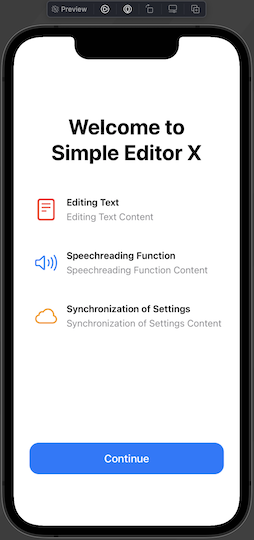
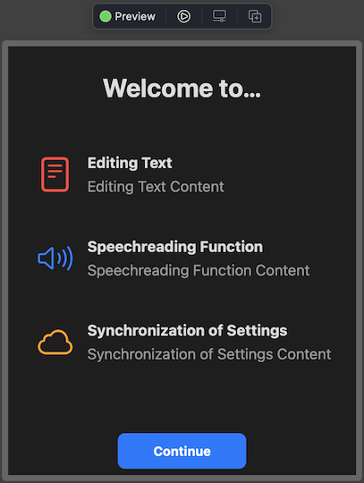

# OnboardingUI

SwiftUI library to implement first-party app-like onboarding   

## Description

This library allows you to implement onboarding designs as implemented in first-party apps in your own apps.
Since the library is made by SwiftUI, you can implement onboarding with fewer lines. It is ideal for introducing new features or displaying at first launch.   

## Demo

The following can be implemented for onboarding  
### macOS

### iPadOS

### iOS
  

## Requirement

The following environment is required to use this library.  
- iOS 17.0+ / iPadOS 17.0+ / macOS 14+ / visionOS 1+
- Xcode 14.0+
- Swift 5.9+

※　watchOS and tvOS are not supported. The reason is that I do not own hardware that runs these two operating systems. If you want to support these OS, please send me a pull request. 
 
## Usage
This framework has two methods: a method that can easily implement the entire onboarding process and a method that can easily implement a portion of it.  

### オンボードを作るビュー
This is the easiest code to onboard.  
<br>
これが最も簡単にオンボードを作成できるコードです。
```swift
        let content = [
            OnboardingItemData(title: "Editing Text",
                               content: "Editing Text Content",
                               systemName: "doc.plaintext",
                               color: .red),
            OnboardingItemData(title: "Speechreading Function",
                               content: "Speechreading Function Content",
                               systemName: "speaker.wave.3",
                               color: .blue),
            OnboardingItemData(title: "Synchronization of Settings",
                               content: "Synchronization of Settings Content",
                               systemName: "icloud",
                               color: .orange)
        ]
        
        OnboardingView(title: "Welcome to\nSimple Editor X",
                       content: content,
                       button: "Continue",
                       action: {
            
        })
```
Below is the result of this execution.  
#### iOS
  
#### macOS
  

### Display on-boarding titles
```swift
        OnboardingTitle("Onboarding Title")
```
or
```swift
        Text("Onboarding Title")
            .onboardingStyle(style: .title)
``` 
Below is the result of this execution.  
#### iOS
  
#### macOS
  

### Display the text of the title of the onboarding item
```swift
        ItemTitle("ItemTitle")
```
or
```swift
        Text("ItemTitle")
            .onboardingStyle(style: .itemTitle)
```

### Display text within onboarding items 
```swift
        ItemContent("ItemContent")
```
or
```swift
        Text("ItemContent")
                .onboardingStyle(style: .itemContent)
```

### Create onboarding items
```swift
        OnboardingItem(systemName: "doc",imageColor: .red) {
            ItemTitle("ItemTitle")
            ItemContent("ItemContent")
        }
```
or
```swift
        OnboardingItem(systemName: "doc",imageColor: .red) {
            Text("ItemTitle")
                .onboardingStyle(style: .itemTitle)
            Text("ItemContent")
                .onboardingStyle(style: .itemContent)
        }
```
Below is the result of this execution.  
(imageColorはオプションで省略可能です。)  
#### iOS
  
#### macOS
  

### オンボーディングのボタンを作成する
```swift
        OnboardingButton(color: .red,"Continue"){
            
        }
```
or
```swift
        Button(action: {
            
        }) {
            Text("Continue")
                .onboardingStyle(style: .button)
        }
        .buttonStyle(ColorButtonStyle(foregroundColor: .white, backgroundColor: .red))
```
Below is the result of this execution.  
<br>
下はこの実行結果です。  
(color/foregroundColor/backgroundColorは省略可能でデフォルトはそれぞれ.blue/.white/.redとなります。)  
#### iOS
  
#### macOS
  
## Install

Xcode is required to use this library.
However, it is currently under development and cannot be installed. We will let you know as soon as possible.  

## Contribution

1. Fork it
2. Create your feature branch
3. Commit your changes
4. Push to the branch
5. Create new Pull Request


## Licence

[OnboardingUI](https://github.com/KC-2001MS/OnboardingUI/blob/main/LICENSE)

## Supporting

If you would like to make a donation to this project, please click here. The money you give will be used to improve my programming skills and maintain the application.
[Pay by PayPal](https://paypal.me/iroiroWork?country.x=JP&locale.x=ja_JP)

## Author

[Keisuke Chinone](https://github.com/KC-2001MS)
