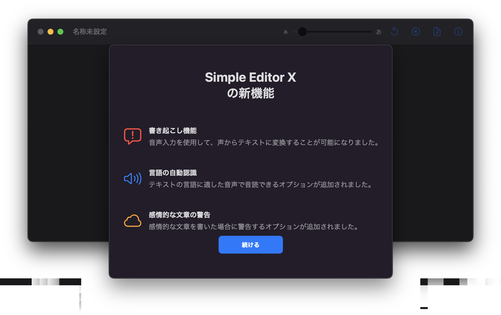
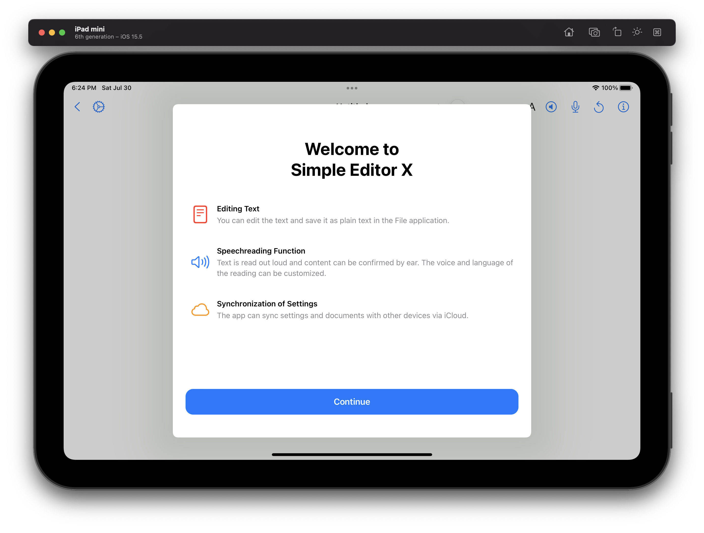
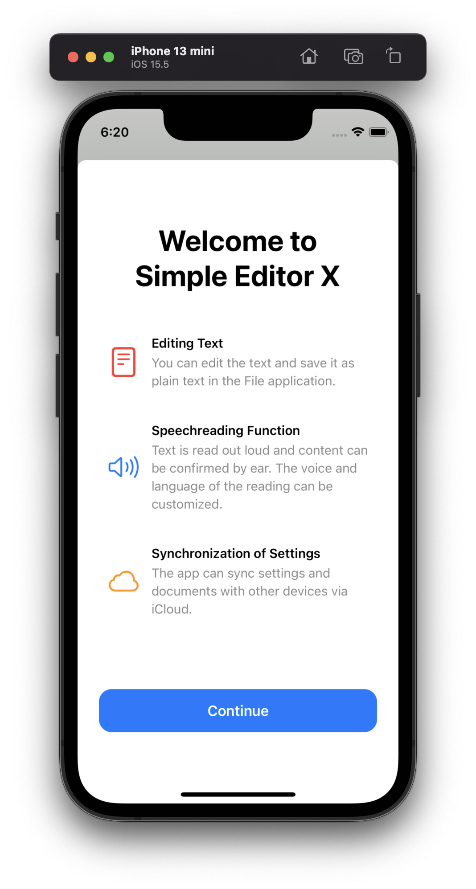
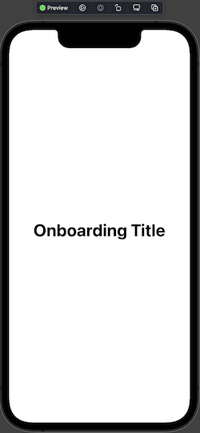
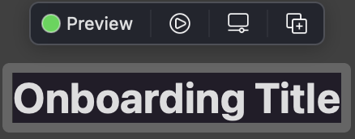
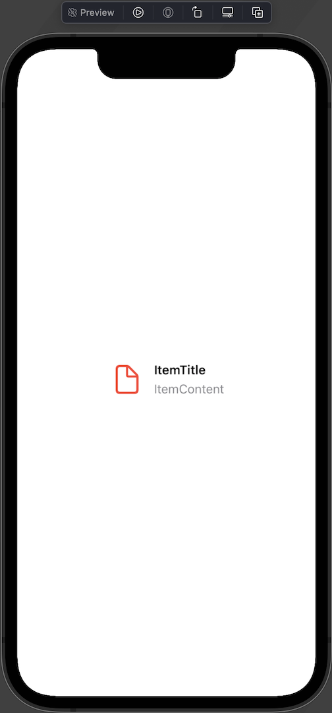
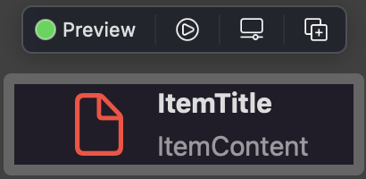
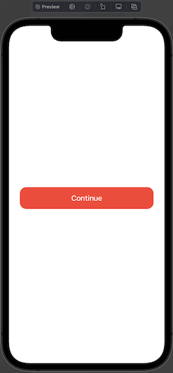
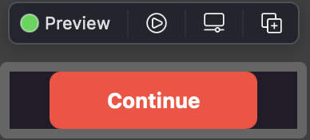

# OnboardingUI
Apple純正アプリのようなオンボーディングを実装できるSwiftUIライブラリ

## 概要(Description)
このライブラリではAppleの純正アプリで実装されているようなオンボーディングのデザインを自身のアプリに実装できるライブラリです。
SwiftUI製のライブラリなので、より少ない行数でオンボーディングを実装できます。新機能の紹介や初回起動時の表示に最適です。

## 実演(Demo)
以下のような、オンボーディングを実装することができます。
### macOS

### iPadOS

### iOS
  

## 必要条件(Requirement)
このライブラリを使用するには以下の環境が必要です。
- iOS 14.0+ / iPadOS 14.0+ / macOS 11+ /
- Xcode 12.0+
- Swift 5.1+

※　watchOSおよびtvOSには対応しません。理由は、私がこの二つのOSが動くハードを所有していないからです。私のモチベーションとみなさまのご協力によっては、実装されるかも知れませんので、これらでの対応をお望みでしたら、プルリクエストをお願いいたします。
## 使い方(Usage)
### オンボーディングのタイトル表示する
```swift
        OnboardingTitle("Onboarding Title")
```
または
```swift
        Text("Onboarding Title")
            .onboardingStyle(style: .title)
```

のコードで以下のようなビューを作成できます。  
#### iOS版
  
#### macOS版
  

### オンボーディングの項目のタイトルのテキストを表示する
以下のように、二つの方法で簡単にオンボーディングの項目のタイトルを作成することができます。
```swift
        ItemTitle("ItemTitle")
```
または
```swift
        Text("ItemTitle")
            .onboardingStyle(style: .itemTitle)
```

### オンボーディングの項目内のテキストを表示する
以下のように、二つの方法で簡単にオンボーディングの項目内のテキストを作成することができます。
```swift
        ItemContent("ItemContent")
```
または
```swift
        Text("ItemContent")
                .onboardingStyle(style: .itemContent)
```

### オンボーディングの項目を作成する
```swift
        OnboardingItem(systemName: "doc",imageColor: .red) {
            ItemTitle("ItemTitle")
            ItemContent("ItemContent")
        }
```
または
```swift
        OnboardingItem(systemName: "doc",imageColor: .red) {
            Text("ItemTitle")
                .onboardingStyle(style: .itemTitle)
            Text("ItemContent")
                .onboardingStyle(style: .itemContent)
        }
```
のコードで以下のようなビューを作成できます。(imageColorはオプションで省略可能です。)  
#### iOS版
  
#### macOS版
  

### オンボーディングのボタンを作成する
```swift
        ContinueButton(color: .red){
            
        }
```
または
```swift
        Button(action: {
            
        }) {
            Text("Continue")
                .onboardingStyle(style: .button)
        }
        .buttonStyle(ColorButtonStyle(foregroundColor: .white, backgroundColor: .red))
```
のコードで以下のようなビューを作成できます。(color/foregroundColor/backgroundColorは省略可能でデフォルトはそれぞれ.blue/.white/.redとなります。)  
#### iOS版
  
#### macOS版
  
## インストール(Install)
このライブラリを使うには、Xcodeが必要です。
ただ、現在開発中のため、インストールはできません。追ってお知らせします。
## 貢献(Contribution)
1. Fork it
2. Create your feature branch
3. Commit your changes
4. Push to the branch
5. Create new Pull Request
## ライセンス(Licence)
[OnboardingUI](https://github.com/KC-2001MS/OnboardingUI/blob/main/LICENSE)
## 作者(Author)
[Keisuke Chinone(Iroiro)](https://github.com/KC-2001MS)

