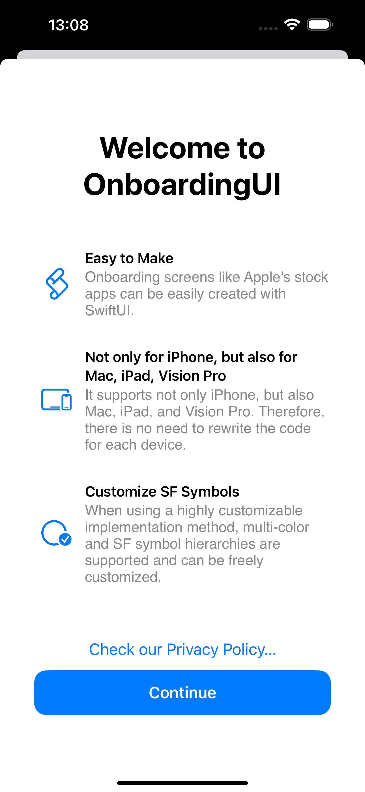
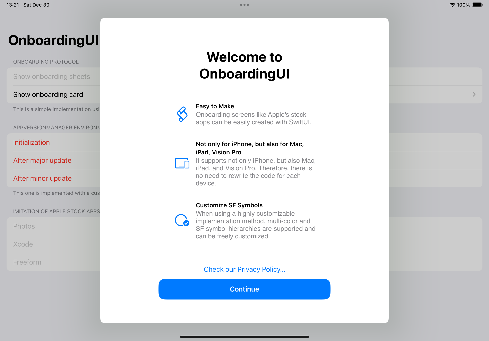
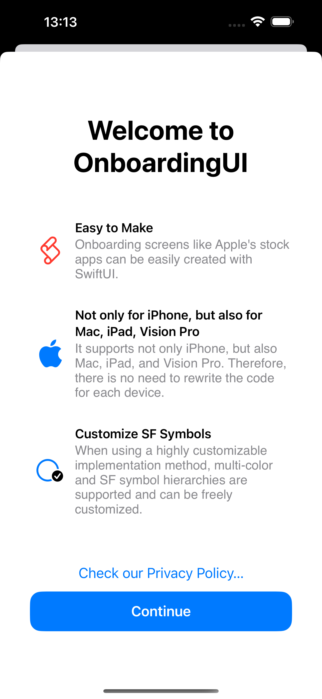

# OnboardingUI

SwiftUI library to implement first-party app-like onboarding

## Description

This library allows you to implement onboarding designs as implemented in first-party apps in your own apps.
Since the library is made by SwiftUI, you can implement onboarding with fewer lines. It is ideal for introducing new features or displaying at first launch.

## Requirement

The following environment is required to use this library.  

<p align="center">
    
    
    
    
    
    
    <a href="https://twitter.com/IroIro1234work">
        
    </a>
</p>

※　We do not support watchOS. This is because the screen size is small for watchOS and we believe that onboarding will negatively impact the user experience.  
※　Support for tvOS is ongoing. Reproducibility is low due to the lack of onboarding documentation for stock tvOS apps and the SwiftUI's unique behavior.

## Language

Supported languages are as follows In regions with languages other than these, English should be displayed.
If you would like to add more supported languages, please edit Localizable.xcstrings and do the translation work.

- English
- Japanese

## Demo

To verify the operation of this library, we created a sample application in the library. Please refer to it.

## Usage

This framework has two methods: a method that can easily implement the entire onboarding process and a method that can easily implement a portion of it.  

### Simple implementation

This is the easiest code to onboard.  

```swift
struct WelcomeOnboarding: Onboarding {
    var title: Text {
        Text("Welcome to\nOnboardingUI")
    }
    
    var features: Array<Feature> {
        Feature(
            "Easy to Make" ,
            imageName: "applescript",
            message: "Onboarding screens like Apple's stock apps can be easily created with SwiftUI."
        )
        
        Feature(
            "Not only for iPhone, but also for Mac, iPad, Vision Pro" ,
            imageName: "apple.logo",
            message: "It supports not only iPhone, but also Mac, iPad, and Vision Pro. Therefore, there is no need to rewrite the code for each device."
        )
#if os(iOS)
        .image(systemName: "ipad.and.iphone")
#elseif os(macOS)
        .image(systemName: "macbook")
#elseif os(tvOS)
        .image(systemName: "appletv")
#elseif os(visionOS)
        .image(systemName: "visionpro")
#endif
        
        Feature(
            "Customize SF Symbols" ,
            imageName: "circle.badge.checkmark",
            message: "When using a highly customizable implementation method, multi-color and SF symbol hierarchies are supported and can be freely customized. However, this feature is not supported in visionOS."
        )
        
#if os(tvOS)
        Feature(
            "Many other benefits" ,
            imageName: "ellipsis",
            message: "Now, tvOS is also supported, making it easy to create onboarding. Now you can create onboarding for all platforms except watchOS."
        )
#endif
    }
}
```

and

```swift
struct SimpleImplementationView: View {
    @Environment(\.appVersionManager) private var appVersionManager
    
    var body: some View {
        @Bindable var appVersionManager = appVersionManager
        SomeView()
            .onboardingSheet(isPresented: $appVersionManager.isTheFirstLaunch, WelcomeOnboarding())
    }
}
```

#### iOS



#### iPadOS



#### macOS

 

#### tvOS

 

#### visionOS

 

### Customizable implementation

```swift
struct WelcomeOnboardingSheetView: View {
    var action: () -> Void
    
    init(action: @escaping () -> Void) {
        self.action = action
    }
    
    var body: some View {
        OnboardingSheetView {
            OnboardingTitle("Welcome to\nOnboardingUI")
        } content: {
            OnboardingItem(systemName: "applescript",shape: .red) {
                OnboardingSubtitle("Easy to Make")
                OnboardingContent("Onboarding screens like Apple's stock apps can be easily created with SwiftUI.")
            }
            
            OnboardingItem(systemName: "apple.logo") {
                OnboardingSubtitle("Not only for iPhone, but also for Mac, iPad, Vision Pro")
                OnboardingContent("It supports not only iPhone, but also Mac, iPad, and Vision Pro. Therefore, there is no need to rewrite the code for each device.")
            }
            
            OnboardingItem(systemName: "circle.badge.checkmark",mode: .palette,primary: .primary,secondary: .blue) {
                OnboardingSubtitle("Customize SF Symbols")
                OnboardingContent("When using a highly customizable implementation method, multi-color and SF symbol hierarchies are supported and can be freely customized.")
            }
            
#if os(tvOS)
            OnboardingItem(systemName: "ellipsis",shape: .white) {
                OnboardingSubtitle("Many other benefits")
                OnboardingContent("Now, tvOS is also supported, making it easy to create onboarding. Now you can create onboarding for all platforms except watchOS.")
            }
#endif
        } link: {
            Link("Check our Privacy Policy…", destination: URL(string: "https://kc-2001ms.github.io/en/privacy.html")!)
        } button: {
            ContinueButton(color: .accentColor, action: action)
        }
    }
}
```

and

```swift
struct SimpleImplementationView: View {
    @Environment(\.appVersionManager) private var appVersionManager
    
    var body: some View {
        @Bindable var appVersionManager = appVersionManager
        SomeView()
            .sheet(isPresented: $appVersionManager.isTheFirstLaunch) {
                WelcomeOnboardingSheetView(action: {
                    appVersionManager.isTheFirstLaunch = false
                })
            }
    }
}
```


#### iOS



#### iPadOS


#### macOS

 

#### tvOS

 

#### visionOS


## Swift-DocC

Swift-DocC is not currently implemented, but will be supported when we have time.

## Install

Xcode is required to use this library.
However, it is currently under development and cannot be installed. We will let you know as soon as possible.  

## Contribution

1. Fork it
2. Create your feature branch
3. Commit your changes
4. Push to the branch
5. Create new Pull Request

## Licence

[OnboardingUI](https://github.com/KC-2001MS/OnboardingUI/blob/main/LICENSE)

## Supporting

If you would like to make a donation to this project, please click here. The money you give will be used to improve my programming skills and maintain the application.   

[Pay by PayPal](https://paypal.me/iroiroWork?country.x=JP&locale.x=ja_JP)

## Author

[Keisuke Chinone](https://github.com/KC-2001MS)
